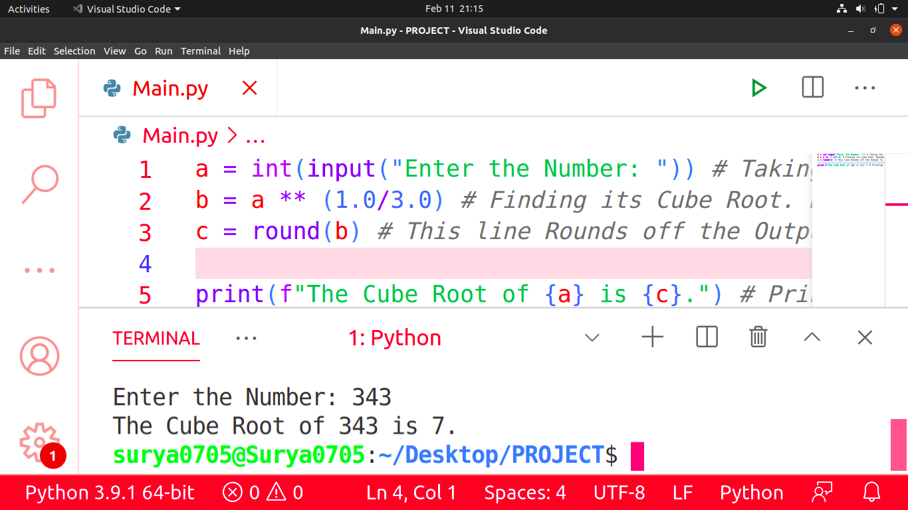

# Cube_Root_Using_Python
This is a Python Program that finds the Cube Root of a Particular Number which is Entered. It doesn't require any Particular Module. This Program just uses some Basic Coding and Mathematical Skills to find the Cube Root of a Particular Number entered. Below is the Screenshot of My Program:

Hope that you Liked it!
